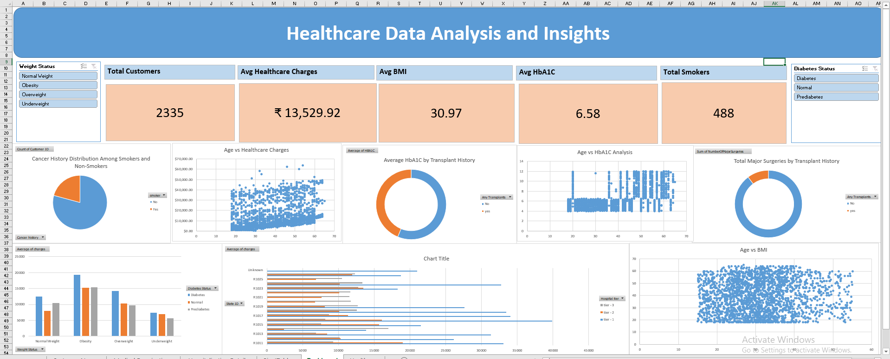

# 🏥 Healthcare Analytics Dashboard (Excel)

## 📌 Project Overview
The **Healthcare Analytics Dashboard** is an interactive Excel-based project designed to analyze patient health data and healthcare costs. It focuses on data cleaning, transformation, analysis, and visualization to generate meaningful insights from multiple healthcare-related attributes.

The dashboard helps understand patterns in BMI, diabetes status, smoking habits, surgeries, transplant history, and healthcare charges using Pivot Tables, charts, and KPI metrics.

---

## 🎯 Objectives
- Clean and preprocess healthcare datasets  
- Handle missing and inconsistent data  
- Perform data transformation and feature engineering  
- Analyze healthcare charges and patient conditions  
- Build interactive Excel dashboards using Pivot Tables and slicers  
- Generate actionable healthcare insights through visualization  

---

## 🛠 Tools & Technologies
- Microsoft Excel  
- Pivot Tables & Pivot Charts  
- VLOOKUP  
- KPI Cards  
- Data Visualization  
- Dashboard Design Principles  

---

## ⭐ Key Features
- Data Cleaning & Missing Value Handling  
- BMI-based Weight Status Classification  
- HbA1C-based Diabetes Status Classification  
- Interactive Dashboard with Slicers  
- Scatter Plot Correlation Analysis  
- Donut, Bar, and Column Charts  
- KPI Reporting System  

---

## 📊 Analysis Performed

### 🥧 Categorical Analysis
- Cancer history among smokers vs non-smokers  
- Major surgeries vs HbA1C levels based on transplant history  

### 📈 Comparative Analysis
- Healthcare charges across Weight Status and Diabetes Status  
- Average charges by Hospital Tier and State  

### 📉 Correlation Analysis
- Age vs BMI  
- Age vs HbA1C  
- Age vs Healthcare Charges  

---

## 📌 KPI Metrics
- Total Customers  
- Average Healthcare Charges  
- Average BMI  
- Average HbA1C  
- Total Smokers  
- Diabetes Patients %  

---

## 📊 Dashboard Features
- Interactive slicers for filtering data  
- KPI summary cards  
- Pivot-based dynamic charts  
- Clean and structured visual layout  
- Data-driven healthcare insights  

---

## 📁 Project Files
- Excel Dashboard File  
- Project Report PDF  
- Dashboard Screenshot  

---

## 📷 Dashboard Preview

---

## 💡 Skills Demonstrated
- Data Cleaning & Preprocessing  
- Data Analysis & Transformation  
- Excel Dashboard Development  
- Business Reporting  
- Data Visualization  
- Analytical Thinking  

---

## 🚀 How to Use
1. Clone or download this repository  
2. Open the Excel dashboard file  
3. Use slicers to filter data  
4. Explore KPIs and charts for insights  

---

## 👤 Author
**Shiyam T**
